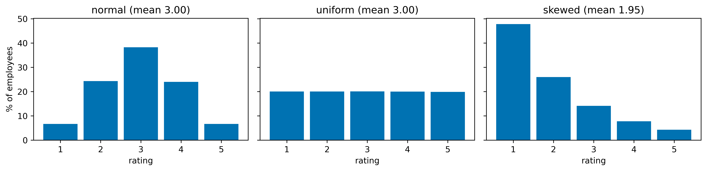
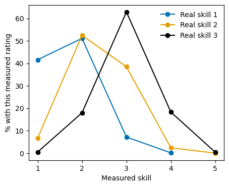
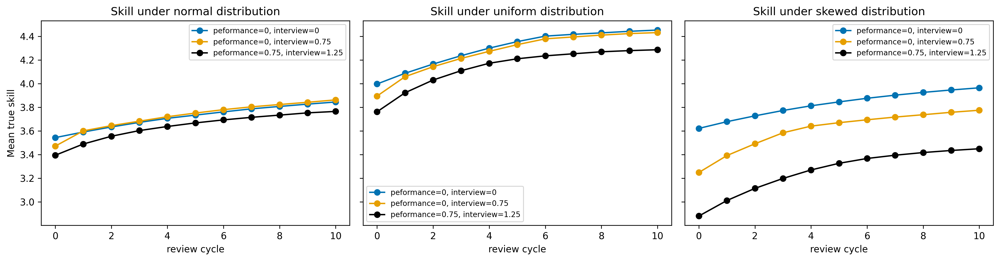
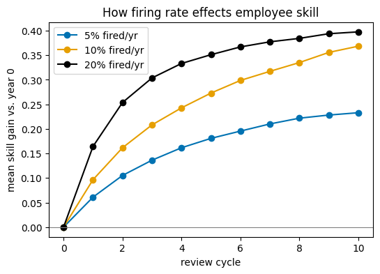
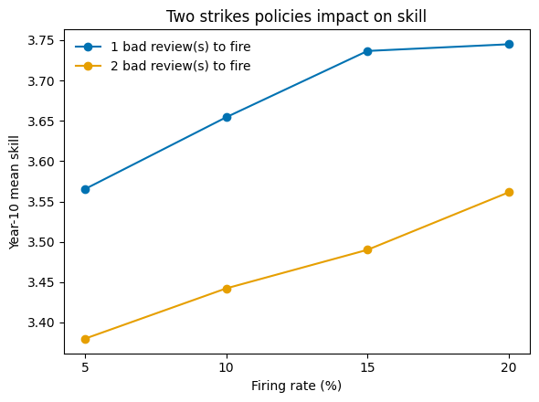
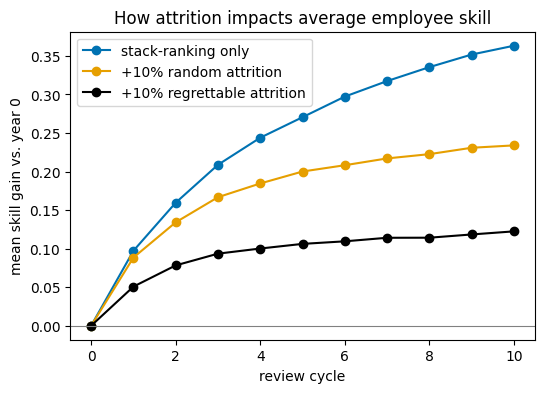
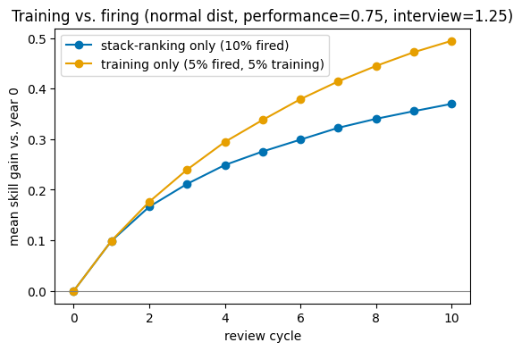

# No, you can't fire your way to a better company
Ten years ago, Meta had a reputation as a company with a high performance bar. Post-COVID, they decided to raise that bar, increasing the number of bad ratings they gave employees from [7% to 20%](https://finance.yahoo.com/news/meta-targets-more-underperformers-mid-150352697.html), in the name of intensity. However, anyone who has ever worked knows that you can't just fire people without repercussions. Morale tanked, and now Meta has a [retention problem](https://blog.pragmaticengineer.com/the-pulse-metas-self-inflicted-resignation-wave/).

As a former Meta scientist experiencing those changes, I thought, "I can model that." The model I built for performance management includes parameters for what skill distributions look like, how many people get fired, how much error there is in measuring performance, and how many people leave when you do it. And while there are a lot of simplifying assumptions going into this model, I think it’s still useful to think about tradeoffs. I found that:
* In a world of no measurement error, and no "regrettable attrition," firing 20% of your people every year can indeed give you +0.4 skill off a baseline of skill of 3.2.
* Adding in measurement errors for hiring and performance evaluations halves this gain to only a +0.2 skill increase
* A two-strikes policy with a 5% quota gets most of the gains of a 20% quota
* If aggressive firing decreases morale and people start leaving, the gains mostly evaporate. This is especially if attrition is biased towards high performers and not random.
* Even modest training outperforms firing people
Given the diminishing returns to firing people, and the significant risk of increasing attrition, most companies should have performance quotas below 10%. Adding in a two strikes policy is also good insurance against performance measurement error. And instead of being the tough CEO who demands greatness, try to make people better.

# The Setup
To simulate performance management, I simplified the idea of performance into giving every employee a fixed skill on a scale of 1-5. These skills could be drawn from three distributions: normal, uniform or skewed.

Figure one: histogram of employee skill for normal, uniform, and skewed distributions. Note that mean of the skewed distribution is lower, reflecting the idea that most candidates do not meet the criteria for highly selective companies.

In addition to an employee's actual skill, when interviewing or evaluating employees, I added measurement error, which I assumed to be normal, with a default of 1.25 sigma for interviewing, and 0.75 sigma for evaluation. While these sigmas are large compared to the mean, I do think there is more error than we like to admit in hiring and evaluation. For example, in the distribution shown below, 15% of people with a skill of 3 are measured as a 2, which ballpark sounds right. 

Figure 2: Distribution of observed skill, based on true skill and measurement error with a sigma of 0.75. X-axis is . For employees with a skill of 3, measurement error leads to 20% of them being labeled as a 2, and a few % labeled as a 1.

Combining employees’ skills and the measurement error, the model then “fired” the bottom X% of employees, and hired new employees to replace them, drawing from the skill distribution with an interviewing measurement error. The hiring bar is set at 3 for most simulations. This was done for ten performance management iterations.

In addition, I simulated attrition as either random, or skewed towards higher performers, with a default of 10% random attrition per year. This 10% attrition might be low for many companies where employees are job hopping, but is probably semi-realistic for companies like Google or Microsoft. See this notebook for details.

A note on AI usage: I built the original model around firing people, but used LLMs to iterate on the model and add things like attrition. The notebook is now mostly LLM written, but this post is my own.

# Measurement error underlies all hiring and firing

As a first look at the simulations, we can plot how average skill level changes under multiple performance reviews. For these simulations, we assume a firing rate of 10%. As a reminder, there are two measurement errors: performance evaluation, and interviewing error. My general assumption is that interviewing is noisier than performance management, and many unqualified people slip through.

Figure 3: Simulations of skill under different distributions (left: normal, middle: uniform, right: skewed) and measurement errors. Measurement errors could be 0, some interview error (sigma = 0.75), or both interview and performance measurement error (sigmas of 1.25 and 0.75). 

Assuming normal distribution of skill, multiple review cycles increase employee skill by approximately 0.2-0.4 skill points, from a starting point of ~3.2-3.5. Comparing across measurement errors, adding in some interview measurement error only really impacted the first review cycle; with low performance measurement error, employees who got lucky on the interview get filtered out quickly. However, adding in performance measurement error led to a decrease of ~0.3 skill points, as companies mistakenly fire skilled people.

The graphs for the other distributions show similar results, where adding interview error leads to a transient dip in skill, but adding performance error leads to a gap that never closes. Also, the skill level for the skewed distribution is notably lower than the other two, despite a common hiring bar. What is happening here is that there are so many more employees with skill level 2 than level 3, that the interviewing error is causing them to be hired more than the higher skilled, but rarer employees.

## Firing more has diminishing returns

Having established this baseline, we can not look at what happens when we change how many people we fire. For this simulation, we leave the performance error (0.75 sigma) and interviewing error (1.25 sigma) fixed between runs (see Figure below). And to simplify comparisons, we can set the baseline to year one performance.

Figure 4: Simulation of long-run skills under different firing regimes. The firing rate was tested at 5%, 10%, and 20%.

In this scenario, there is a clear performance gain from firing more people. The long term gains to firing 20% are ~0.4 skill points compared to ~0.25 skill points for firing 5%. However, notice, this is not linear. Firing 4x more people only led to a +60% increase in gains.

It is difficult to think through how to contextualize these gains against a baseline. We have made a modeling assumption that the hiring bar is 3, and so we could try to compare these +0.4 skill gains against that baseline. However, that is putting a lot of weight on an extreme simplifying assumption. Speaking directionally (as my first tech boss loved to say), it does point to the idea that gains from performance management are diminishing. Most tech companies have arduous hiring processes, and pull from the top of the skill distribution. Any gains from firing are likely modest against a high baseline.

# Two strikes are better than one

One thing common in stories about past Meta culture is the idea that everybody gets a Meets Most at some point. Bad ratings were fine as long as someone improved afterwards. But people didn’t get fired unless they got at least two bad ratings in a row, giving them time to improve. Theoretically, a two strikes policy can reduce the impact of measurement errors at performance evaluation, so we can simulate that as well, and different firing rates.

Figure 5: Long-term company skill under different firing regimes. Each point represents the ten-year average skill at a company. Employees are fired either after one (blue) or two strikes (yellow). The x-axis explores different firing rates, ranging from 5-20%.

As the graph above shows, at every firing percent, having a two strikes policy increased skill, such that having a two strikes policy at a 5% firing rates led to a similar skill as a 20% firing policy. This is a structural outcome, as if you have high measurement error, taking two samples will reduce your variance mechanistically over one sample.

## Attrition attrits most of the gains

When Meta started firing people willy-nilly, mainstream news started [reporting on how much morale fell](https://www.reuters.com/investigations/mark-zuckerberg-had-bold-plan-replace-meta-staff-with-ai-heres-how-it-imploded-2026-08-26/), and rumors have it that attrition has begun to pick up. To model how attrition can impact employee skill, we can simulate attrition in a few ways. First, we can simulate an increase in random attrition, from 10% to 20%. Second, we can make an assumption that the best employees are the most likely to leave when morale goes down, and scale the departure rate with employee skill.

Figure 6: Simulation of how attrition impacts skills. The baseline is firing 10% and 10% attrition (blue), increase in random attrition to 20% (yellow) and increase in regrettable attrition (black).

In the simple scenario where random attrition increases to 20%, around 30% of the gains from performance management go away. And if that 20% starts to skew towards the most skilled employees, a full 60% of the skill gains from firing people go away.

# Training people has higher long term impact

What if, instead of treating employees as fungible, fireable robots, we had a late 2010s growth mindset, and tried to make them better? I considered a few ways to simulate employee growth, and settled on the idea that we can close the gap between an employees current and idealized skill. In practical terms, this means we can increase an employees skill every year by X% of the gap between their skill and a perfect 5 skill (if we added a fixed skill increase, 5 skill employees would be out of bounds).

Figure 7: Impact of training on skill improvement. The baseline has 10% firing (blue), while the training scenario reduces the firing quota to 5%, but has each employee improve by 5% each year.

The above graph shows that if you decrease your firing rate from 10% to 5%, but find a way to increase employee skill by 5%, in the long run you do even better. This assumption of 5% performance improvement is quite mild, and could probably be exceeded by people early in their careers, or who are particularly motivated.

Why don’t people do this? Obviously, I am not a VP, and don’t have data on this, but my guess is that it’s because it’s hard. To train employees, you need to have a clear idea of what you want them doing, and someone to teach them. And come performance review time, the people who did that are going to be evaluated on their quarterly or yearly impact, on not on how they improved people’s skills.

# Conclusion

To reiterate the summary at the start: firing people only really increases a company’s skill base if you assume there is no measurement error, and no impact on attrition. In reality, neither is true, and companies like Amazon or Meta who implements firing quotas is probably fooling themselves in terms of how much it is improving their skill base.

These simulations also gloss over many of the other costs of firing. Every person that is fired requires a dozens of interviews. Then the new person needs to ramp up. People need to cover the on-calls for the missing person. These are all hard to quantify, and might be able to be rolled up into morale and attrition.

As someone with years of experience in tech ranging from Microsoft to 100 person startups, I think my optimal solution is something like a 5% quota for bad reviews, a two strike policy, and an emphasis on employee training. I do think a quota is necessary: I worked at Twitter pre-Musk and at Microsoft, and there was dead wood at those places that needed to be cleared, and a 5% quota might have helped. But there are diminishing returns to this quota: once you fire the incompetent people, everyone else is mostly fine.

No company I have ever worked at was serious about employee development. I would fill in my growth goals for the year, and they would be forgotten until the next year, even for my best managers. If a company were to truly take this seriously, they could probably crush.
